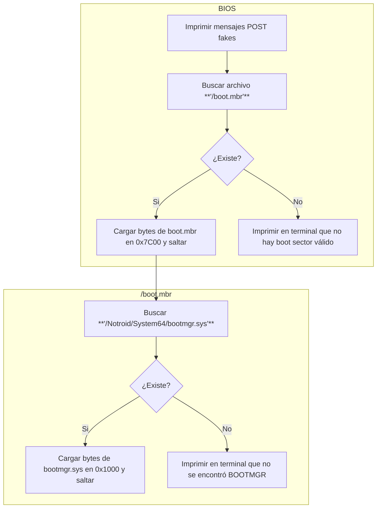

# NOTAS DE NOTROID
> (ten por seguro que nada de esto está implementado 🗿)

## RAM
Notroid si tiene memoria simulada jeje, nada más.

---

## CPU
Ejecutará el array de bytes que le pasemos. Lo único que interactuará con el sistema. No he pensado en implementar que ejecute de una memoria simulada todavía.

### Registros
Los mismos básicos de `assembly` (`AX`, `BX`, `CX` y `DX`) y `PC` como **Program Counter**.

### OP Codes
- `0xB0..0xB7 imm8`: Mueve **imm8** a `{al, bl, cl, dl, ah, bh, ch, dh}`.
- `0xB8..0xBB imm16`: Mueve **imm16** a `{ax, bx, cx, dx}`.
- `0xCD imm8`: Interrumpe a la **BIOS**.
- `0xF4`: Detiene la **CPU**.

### Interrupciones BIOS
- `0x00`: Cambia el modo de video.
- - `ax`: El modo de video.
- - - `0x7C00`: Cambia a modo `text`.
- - - `0xB800`: Cambia a modo `vga`.
- `0x01`: Limpia la Terminal.
- `0x10`: Imprime un caracter.
- - `al`: El caracter a imprimir.
- `0x20`: Leer archivo y cargarlo en RAM.
- - `ax`: Longitud máxima a leer.
- - `bx`: Dirección RAM dónde cargar el archivo.
- - `dx`: Puntero absoluto a la cadena de la ruta (la cadena debe terminar en `0x00`).

---

## Booteo de Notroid

---

## Preguntas
- El método `FileSystem.write()`, ¿debería crear el archivo y las carpetas si no existen o no?
-

## Cosas que deberán estár:
- BSOD
- notkrnl.sys
- launcher.sys (como explorer.exe en Windows)
- más archivos críticos de sistema...
