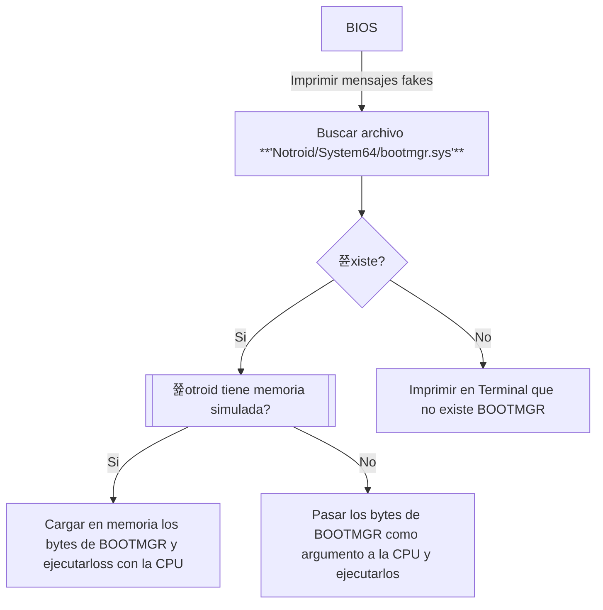

# NOTAS DE NOTROID
> (ten por seguro que nada de esto está implementado 🗿)

## RAM
Notroid si tiene memoria simulada jeje, nada más.

---

## CPU
Ejecutará el array de bytes que le pasemos. Lo único que interactuará con el sistema. No he pensado en implementar que ejecute de una memoria simulada todavía.

### Registros
Los mismos básicos de `assembly` (`AX`, `BX`, `CX` y `DX`) y `PC` como **Program Counter**.

### OP Codes
- `0xB0..0xB7 imm8`: Mueve **imm8** a `{al, bl, cl, dl, ah, bh, ch, dh}`.
- `0xB8..0xBB imm16`: Mueve **imm16** a `{ax, bx, cx, dx}`.
- `0xCD imm8`: Interrumpe a la **BIOS**.

### Interrupciones BIOS:
- `0x00`: Cambia el modo de video.
- - `AX`: El modo de video.
- - - `0x7C00`: Cambia a modo `text`.
- - - `0xB800`: Cambia a modo `vga`.
- `0x10`: Imprime un caracter.
- - `AL`: El caracter a imprimir.

---

## Booteo de Notroid:

---

## Preguntas
- 쮻ebo a침adir memoria simulada, y en vez de pasar los bytes por ejecutar a la CPU mejor cargo las instrucciones en memoria y solamente ejecutar esa parte de la memoria?
