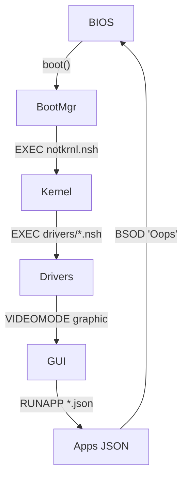

#  Notroid 2.0 - El OS que Android teme


> **Lema Oficial**:  
> *"Si no puedes crashearlo, ¿realmente es un sistema operativo?"*  
> **Lema No-Oficial**:  
> *"System32 es solo una sugerencia"*

## 🌟 DEMO VIVA
```bash
# ¿Quieres verlo en acción? ¡Clona y destruye!
git clone https://github.com/12stevedev/Notroid_2.0.git
cd Notroid_2.0 && xdg-open not.html  # O arrastra a tu navegador
```

## 🔥 ¿Qué coño es esto?
Un **OS simulado en JS/HTML/CSS** donde:
- El **filesystem vive en localStorage** (sí, puedes borrarlo con `localStorage.clear()`)
- Las **apps son JSON** (adiós XML, hola caos organizado)
- **`rm -rf /` es un feature** (no un bug)
- **9 + 11 = 🛩🗼🔥** (y otros easter eggs matemáticos)

## 🛠️ Arquitectura del Caos


## 📂 Filesystem: Tu Playground Digital
Estructura tipo Unix **pero con esteroides**:
```js
/Notroid
 ├── System64/
 │   ├── bootmgr.nsh       // "Hola mundo" del OS
 │   ├── notkrnl.nsh       // Kernel (más pequeño que tu ego)
 │   └── drivers/
 │       └── display.nsh   // Modo VGA o texto
 ├── apps/
 │   └── miapp.json        // Apps como JSON (¡sorpresa!)
 └── home/
     └── user/             // Aquí guardas tus memes
```

**API del FS:**
```javascript
NotroidFS.read("/Notroid/system/bootmgr.nsh")  // [código, contenido]
NotroidFS.write("/README.txt", "Hack me")      // ¡Sobrescribe como root!
NotroidFS.rm("/Notroid")                       // ¿Jugando a ser Dios?
```

## 💻 Cómo Ejecutar (y Destruir)
1. **Clona el repo**:
   ```bash
   git clone https://github.com/12stevedev/Notroid_2.0.git
   ```
2. **Abre `not.html`** en Chrome/Firefox/Edge (sí, incluso en IE si te gusta sufrir)
3. **Debuggea como hacker**:
   ```javascript
   // Accede al kernel desde la consola
   BIOS.boot()  // Reinicia la locura
   Notroid.BSOD("Mi primer pantallazo azul ❤️")
   ```

## 🎨 Creando Apps (JSON Style)
Estructura mínima para una app:
```json
{
  "manifest": {
    "id": "hitleros_simulator",
    "name": "HitlerOS Simulator 🛩🗼🔥",
    "icon": "data:image/png;base64,..."
  },
  "main": {
    "onCreate": ["SHOW_TOAST", "9 + 11 = 🛩🗼🔥"]
  },
  "screens": {
    "MAIN": [
      {"type": "button", "text": "Autodestruir", "action": ["BSOD"]}
    ]
  }
}
```

**Acciones disponibles**:
- `SHOW_TOAST "mensaje"` - Notificación estilo Android (pero más cool)
- `NAVIGATE_TO "screen"` - Cambia entre pantallas
- `BSOD "mensaje"` - El clásico pantallazo azul (feature, no bug)

## 📜 NotShell: Tu Intérprete de Caos
Lenguaje de scripting del sistema:
```bash
# Ejemplo de bootmgr.nsh
ECHO "Iniciando Notroid..."
EXEC /Notroid/system/notkrnl.nsh
ONERROR BSOD "Error crítico: Falta café"
```

**Comandos clave**:
| Comando          | Descripción                                  | Permisos   |
|------------------|----------------------------------------------|------------|
| `LOG mensaje`    | Debuggea en consola                          | User       |
| `EXEC archivo`   | Ejecuta otro script                          | Kernel     |
| `BSOD mensaje`   | Crash elegante (azul incluido)               | Root       |
| `VIDEOMODE`      | Cambia entre modo texto/gráfico              | Driver     |

## 🧩 Estructura del Código
```python
📁 src/
├── core/
│   ├── notroid.js     # Cerebro del OS (procesos, ejecución)
│   ├── fs.js          # Filesystem en localStorage (¡magia!)
│   ├── bios.js        # Pantalla de inicio épica
│   └── terminal.js    # Terminal retro (verde sobre negro)
├── ui/
│   └── windows.js     # Ventanas draggables (como Windows 95)
└── utils.js           # $(), $$(), sleep() - Los básicos
```

## 🚨 FAQ (Preguntas Incómodas)
**❓ ¿Por qué hacer otro OS?**  
*R: Porque Android se volvió aburrido y alguien tenía que decirle.*

**❓ ¿Es compatible con F-Droid?**  
*R: No, pero puedes escribir `INSTALL_APP` en un JSON (más fácil que lidiar con APKs).*

**❓ ¿Dónde están los unit tests?**  
*R: Los unit tests son como las dietas: todos hablan de ellos pero nadie los hace.*

## 🎮 Easter Eggs
1. Ejecuta el BIOS después de las 10PM para mensajes secretos 🌙
2. Intenta borrar `/Notroid/system` y mira el mundo arder 🔥
3. Fecha especial: 11 de septiembre (🛩🗼🔥)

## 👾 Capturas de Pantalla
| Modo Texto | Modo Gráfico | BSOD Mode |
|------------|--------------|-----------|
|  |  |  |

## 🤝 Cómo Contribuir
1. Haz fork (como un `git clone` pero con esteroides)
2. Añade un toast épico (ej: `"Hackeado por ti <3"`)
3. Manda un PR (y prepárate para los memes)

**Ejemplo de contribución épica**:
```json
// En tu app.json
"onCreate": ["SHOW_TOAST", "¡Gracias por contribuir, crack! 🗿🔥"]
```

## 📜 Licencia
**WTFPL** - Haz lo que te dé la gana (pero no me demandes si `rm -rf /` borra tu vida)

---
> *"Notroid no es un OS, es una declaración de principios:  
> Si no puedes crashearlo, no es lo suficientemente open-source."*  
> \- **12steve**, Creador y Agente del Caos
